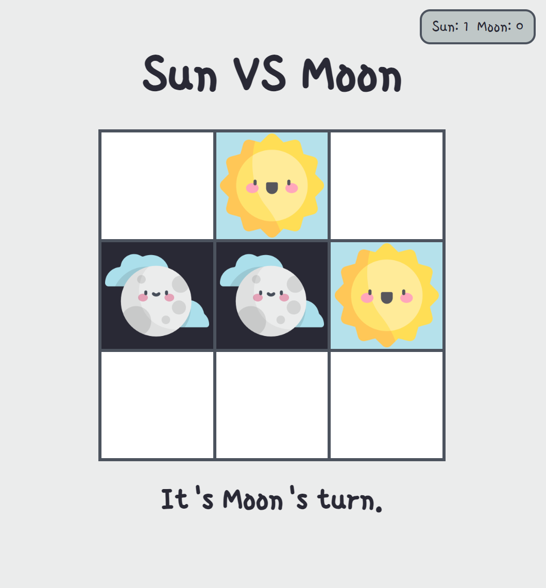

# Sun vs. Moon

Sun vs. Moon is a vanilla JS Tic-Tac-Toe game. Compete with a friend to see who's the best of the best over multiple rounds!

I made this game earlier in my JS journey. It allowed me to practice concepts that were new to me at the time, like conditionally displaying elements and adding images or classes in response to user events.

### Features:
- random starting player each round
- restart button after each round
- scorecard displays after first round
- responsive web page allows for play on all devices

### Languages, Tools & Technologies:
- HTML
- CSS
- Javascript

*If you run this project locally, please use a server. JS modules do not work with the file:// protocol.*